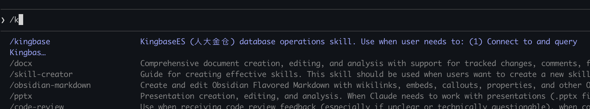

## 说明

本仓库提供一个面向 KingbaseES（人大金仓，PostgreSQL 兼容）的 Claude Skill：`kingbase`。它通过一组 Python 脚本完成连接、查询、DML/DDL 执行、库表结构探查与 SQL 校验等能力。

## 目录结构

- `skills/kingbase/SKILL.md`：Skill 入口文件（包含 name/description 与使用说明）
- `skills/kingbase/scripts/`：实现脚本（连接、查询、执行、结构、校验）
- `skills/kingbase/references/`：补充参考（语法、校验规则、最佳实践）

## 适用场景

- 连接 KingbaseES 并查询数据（SELECT）
- 执行写入/变更（INSERT/UPDATE/DELETE/TRUNCATE）
- 执行 DDL（建表、删表、改表、索引等）
- 查询库/Schema/表/字段/索引等结构信息
- 执行前对 SQL 做语法/安全/性能/命名校验

## 连接配置

默认从环境变量读取，你也可以在对话时设置以下条件：

```bash
export KINGBASE_HOST=localhost
export KINGBASE_PORT=54321
export KINGBASE_DATABASE=test
export KINGBASE_USER=system
export KINGBASE_PASSWORD=your_password
export KINGBASE_SCHEMA=public
export KINGBASE_CONNECT_TIMEOUT=10
```

## 使用方式

- 将 `skills/` 目录放入你的 Claude Skills 可加载路径，或在你的 Skills 配置中指向该目录后，Claude 会在你提到 “kingbase / 人大金仓 / KingbaseES” 且意图与数据库操作相关时触发该 Skill。

- 直接/kingbase 
    

说明：不同的 Claude/宿主环境对 “Skills 目录如何注册/加载” 的方式可能不同，但通常都会以 `SKILL.md` 作为入口描述文件。


